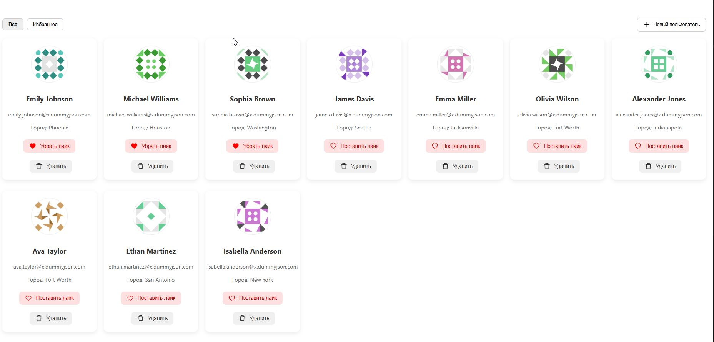
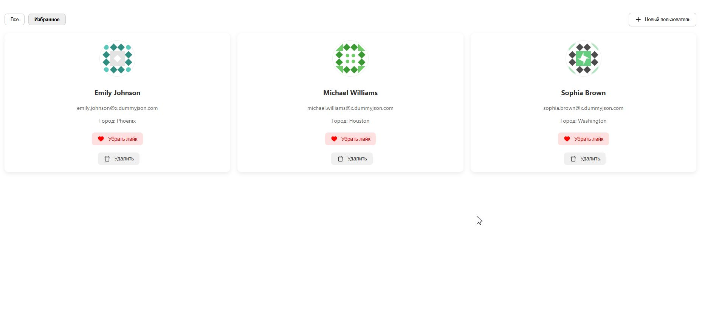
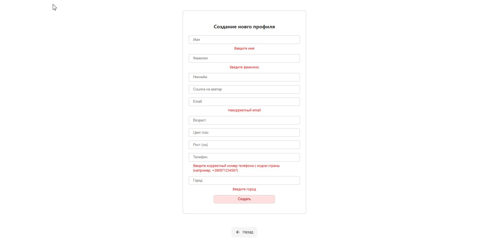
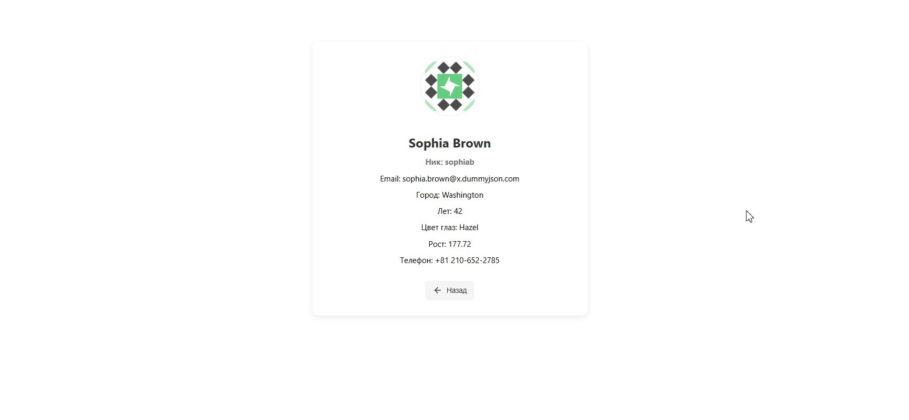

### 👤 User Profiles App

Приложение для создания, отображения, фильтрации и удаления пользовательских профилей. Поддерживает добавление пользователей через форму с валидацией, отображение деталей профиля и отметку "избранное".

## 🌐 Деплой

Проект доступен по адресу:  
[https://missirina1.github.io/user-profiles-app](https://missirina1.github.io/user-profiles-app)

## 📸 Превью

Скриншоты интерфейса приложения:






## 🚀 Функциональность

-Просмотр списка пользователей

-Добавление нового пользователя

-Удаление пользователя

-Отметка пользователя как "избранного"

-Фильтрация по избранным

-Просмотр подробной информации о пользователе

-Валидация формы при добавлении

## 🛠️ Технологии

-React

-Zustand – глобальное хранилище

-React Router DOM – навигация

-CSS Modules – стилизация

-React Icons – иконки

## 🔧 Установка и запуск

1. Клонируй репозиторий:

```
git clone https://github.com/missirina1/User-profiles-app.git
cd user-profiles-app
```

2. Установи зависимости:

```
npm install
```

3. Запусти проект:

```
npm start
```

## 📌 Планы по доработке

-Добавить фильтрацию по возрасту, росту и городу

-Улучшить стили и добавить темную тему
